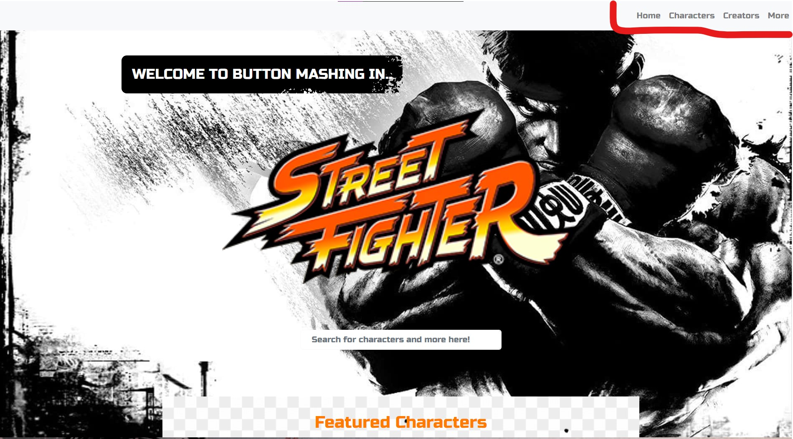
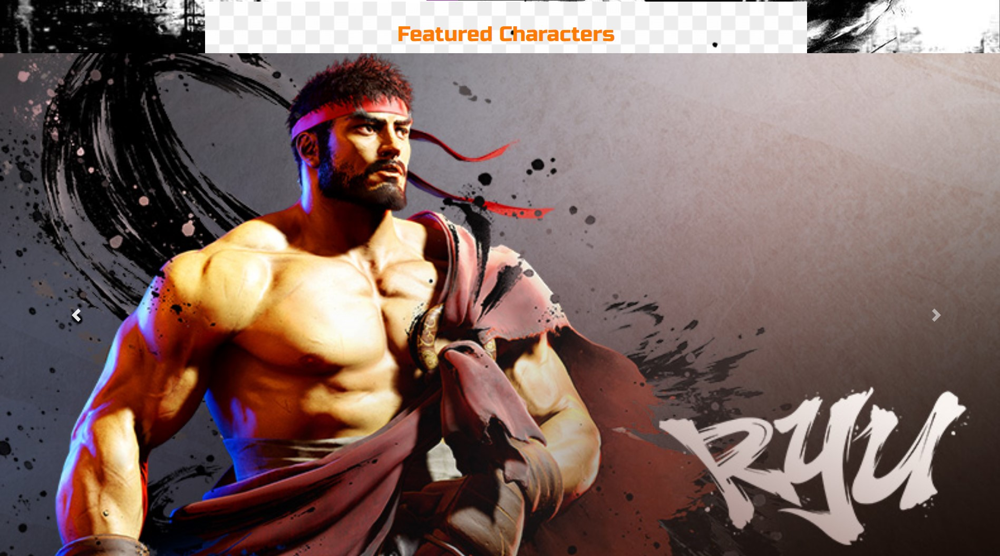
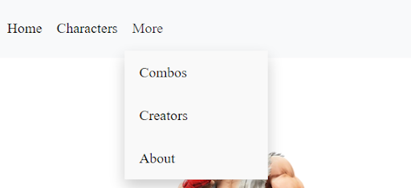
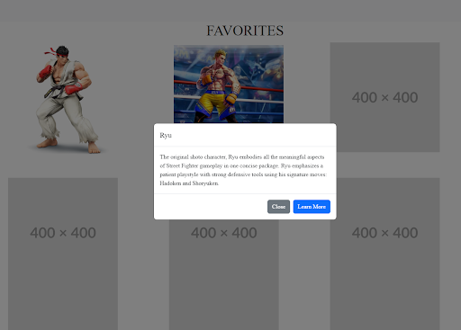
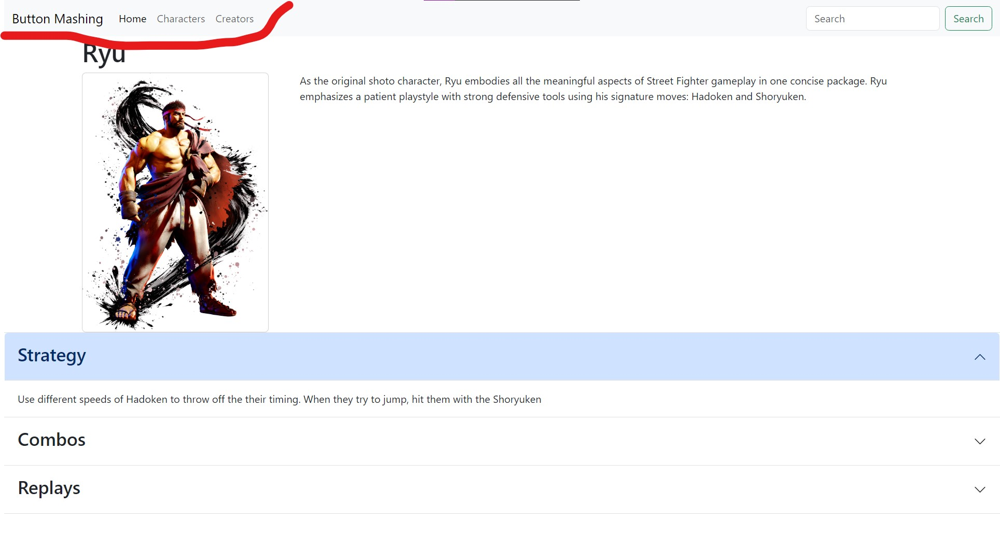
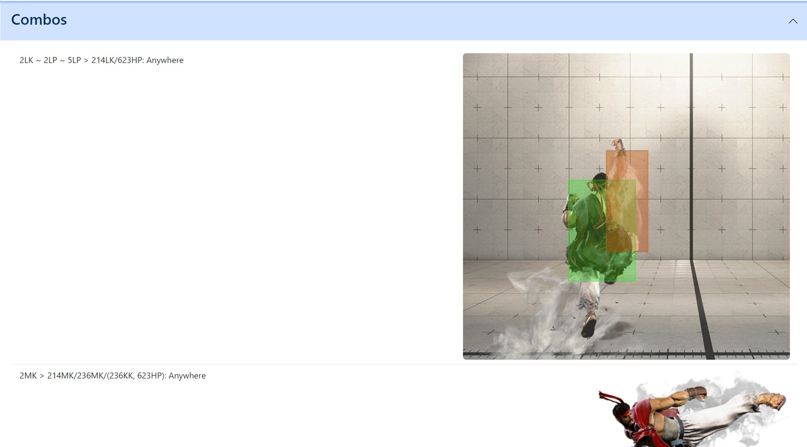
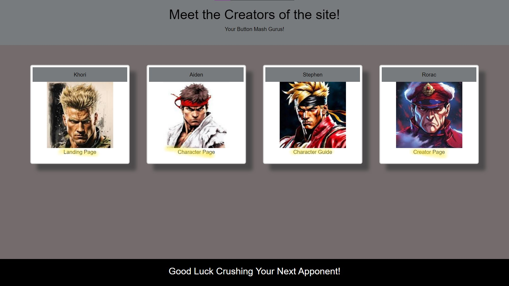

# Guide to Button Mashing in Street Fighter 6

## Description

As a big fan of Street Fighter 6, I have been wanting to get more people into the series so we can play together. Since most people claim that fighting games are notoriously difficult to learn and get into, we wanted to create a beginner friendly website that would ease the onboarding process.

Here's how:

- Easy to navigate pages
- <strong>CLICKABLE LINKS</strong>
- Character guides with condensed information

## Usage

Provide instructions and examples for use. Include screenshots as needed.

### Landing Page

Each page will have navbars link to the Landing Page, Characters Page, and Creators Page respectively.

The carousel of images will cycle through available characters. Clicking on the images will redirect the user to the Character Guide page for the respective character.

### Characters Page

Each page will have navbars link to the Landing Page, Characters Page, and Creators Page respectively.

Clicking on a character will pop up a modal with a short bio.

Clicking the learn more button will direct the user to the Character Guide page.

### Character Guides

Each page will have navbars link to the Landing Page, Characters Page, and Creators Page respectively.

Each section may be expanded or collapsed to reveal the contents within.

### Creators

This page has the coolest links to the Landing Page, Characters Page, Character Guide Page, and Creators Page respectively.
- Accessing the Character Guides Page through the Creators Page before picking a character will lead to a fun surprise.

## Credits

Aidan Choi: achoi2k20
Khori Moore: khorimoore
Rorac Johnson: RoracJ
Stephen Lee: leestephen0320

## License

Distributed under the MIT License. See LICENSE.txt for more information.